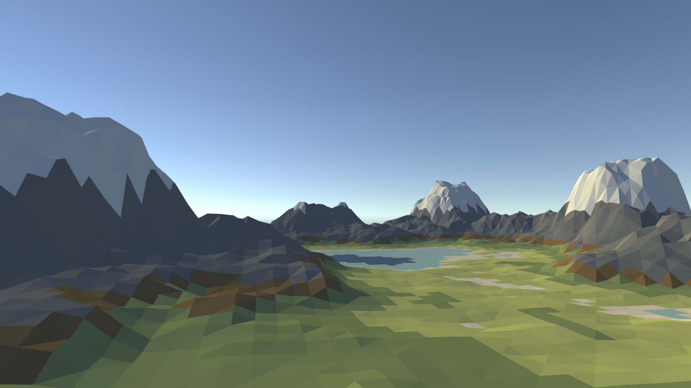
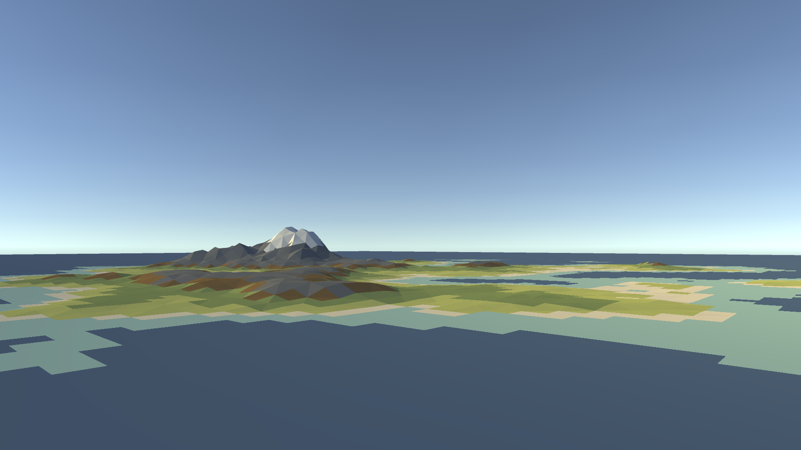
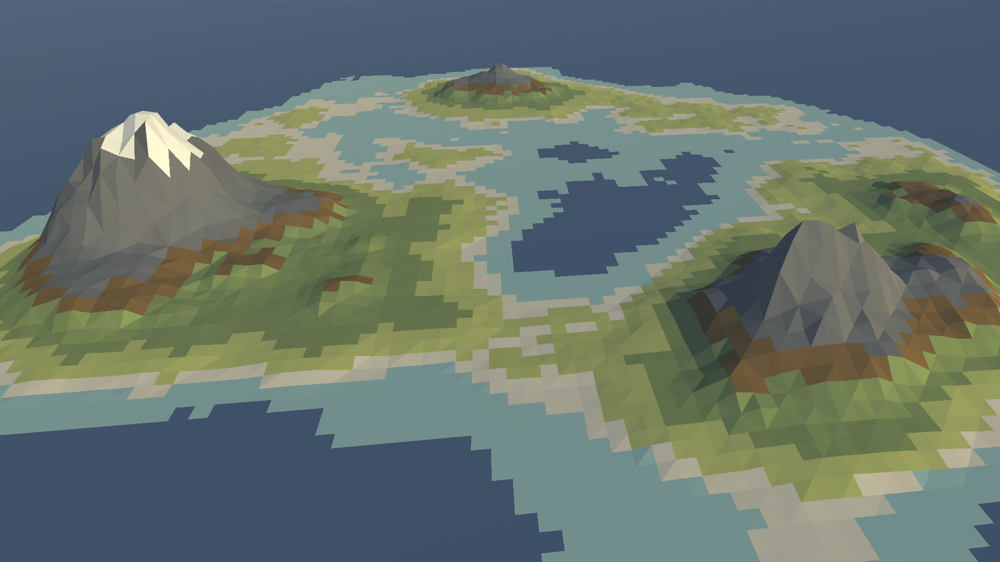
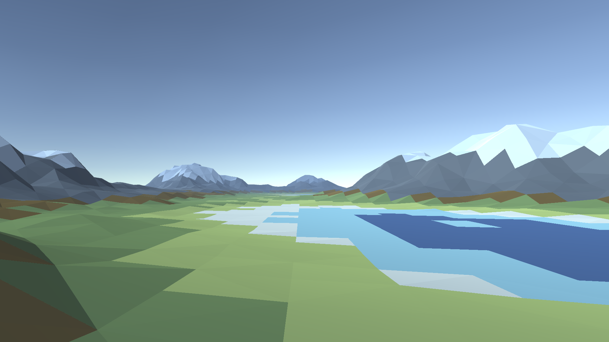
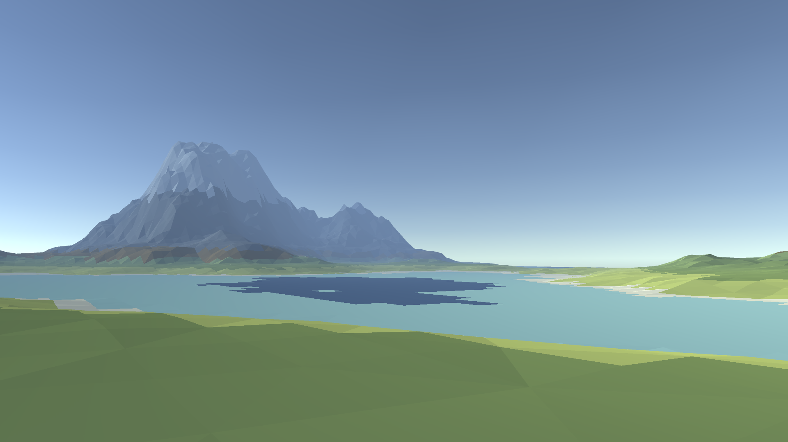

# Simple Random Terrain Generator

Simple terrains generated from perlin noise using the Unity engine and editor. A set number of "octaves" 
(noise layers with increasing frequency) are added together to simulate bigger and smaller terrain features.
A mesh is generated by mapping the noise values to the height of each vertex. "Island mode" is implemented by subtracting
a vignette shape from the noise.

 
 
